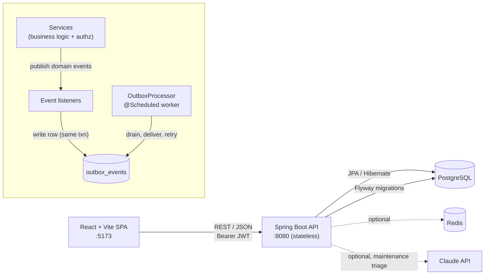

# RentalOps

**A full-stack rental-property management platform** — properties, tenants, leases, rent
billing and maintenance, run from a single operations workspace.

Built as a portfolio project to demonstrate production-grade backend architecture: stateless
JWT auth with per-row data scoping, schema migrations, an event-driven domain with a
transactional **outbox**, safe scheduled jobs for a multi-instance deployment, optimistic &
pessimistic locking, and a couple of genuinely differentiating features (AI-assisted
maintenance triage, tenant payment-reliability scoring).


---

## Table of contents

- [What it does](#what-it-does)
- [Screens](#screens)
- [Tech stack](#tech-stack)
- [Architecture](#architecture)
- [Notable engineering](#notable-engineering)
- [Domain model](#domain-model)
- [Running locally](#running-locally)
- [Configuration](#configuration)
- [API overview](#api-overview)
- [Testing & CI](#testing--ci)
- [Project structure](#project-structure)
- [Roadmap](#roadmap)

---

## What it does

Three roles, one system:

| Role | Capabilities |
|------|--------------|
| **Admin** | Manage staff accounts (create managers, enable/disable, reset passwords); system-wide dashboard; visibility into every record; operate the event outbox |
| **Property manager** | Full lifecycle for *their own* portfolio — properties, tenants, leases, rent, maintenance; sees only their own data |
| **Tenant** | Self-service portal — view their property & lease, track rent status, raise and follow maintenance requests |

Core workflows, beyond CRUD:

- **Lease lifecycle** — `DRAFT → ACTIVE → (EXPIRED | TERMINATED)`, with unit-occupancy tracking, renewal into a linked follow-on lease, and activation guarded against double-booking a unit.
- **Automatic rent billing** — each active lease walks a billing pointer forward, generating one rent charge per month ahead of its due date; idempotent, runs on a schedule.
- **Housekeeping** — nightly sweep marks overdue rent, expires ended leases and frees their units, and sends lease-expiry reminders at 30 / 14 / 7 / 1 days.
- **Maintenance triage** — every new request is auto-classified (category, priority, cost band, a drafted tenant reply) by Claude when an API key is configured, or a deterministic keyword classifier otherwise.
- **Payment-reliability scoring** — each tenant gets a recency-weighted 0–100 score with a human-readable explanation and a "likely to miss next payment" flag; the manager dashboard surfaces a *rent-at-risk* view with total outstanding exposure.
- **In-app notifications** — delivered reliably through a transactional outbox (see [below](#1-reliable-events--the-transactional-outbox)).

---

## Screens


---

## Tech stack

| Layer | Choices |
|-------|---------|
| **Backend** | Java 21, Spring Boot 3.2 (Web, Data JPA, Security, Validation, Cache), Hibernate 6 |
| **Database** | PostgreSQL 16+ (production/dev), H2 in PostgreSQL mode (tests) |
| **Migrations** | Flyway |
| **Auth** | Stateless JWT (jjwt), BCrypt, role-based + per-row authorization |
| **Async / messaging** | Spring `ApplicationEventPublisher` domain events + DB-backed outbox + `@Scheduled` workers |
| **Caching / rate-limiting** | Caffeine by default; Redis optional (feature-flagged) |
| **AI** | `anthropic-java` SDK (optional, for maintenance triage) |
| **API docs** | springdoc-openapi / Swagger UI |
| **Frontend** | React 19 + TypeScript 5.7, Vite 6, React Router 7, hand-rolled typed `fetch` data layer (no TanStack Query / Redux) |
| **CI** | GitHub Actions — `mvn verify` + `npm run build` |
| **Local infra** | Docker Compose (Postgres) |

---

## Architecture



**Request path:** `Controller` (thin — validation only) → `Service` (all business logic and
authorization) → `Repository`. Entities never leave the service layer; every response is a
DTO `record` with a static `from(...)` mapper.

**Data scoping** is enforced in every list/read service, not with annotations: admin sees
everything, a manager's queries are constrained to `property.manager = currentUser`, a tenant's
to their own records — combined with request filters via JPA `Specification`s.

**Schema** is owned by Flyway (`ddl-auto: validate` — Hibernate only checks the mapping
matches). Six migrations, `V1`–`V6`.

---

## Notable engineering

### 1. Reliable events — the transactional outbox

Side effects are never fired from inside the transaction that caused them.

When a maintenance request is created (or a lease activated, rent charge generated, …) the
service publishes a domain event. A listener turns that event into a single **`outbox_events`
row**, written *in the same transaction* as the business change — so "the request exists" and
"a notification is owed" commit together atomically, or not at all.

A separate `OutboxProcessor` drains `PENDING` rows every ~10 s (and on startup), each in its
own transaction, with per-row retries; a row that fails 5× is parked as `FAILED` for
inspection and manual replay. There is no window where the business fact and its side effect
can silently diverge, and no side effect blocks the request path.

```
POST /maintenance-requests ──┐  one transaction
  save request               │
  publish event ─► listener ─► INSERT outbox_events(status=PENDING, payload=json)
                             ┘  commit

OutboxProcessor (every ~10s, single instance via a DB lock)
  SELECT ... WHERE status='PENDING' ORDER BY created_at LIMIT 100
  per row, own transaction: deserialize → create Notification → mark PROCESSED
  on failure: retry_count++ (back to PENDING); after 5 → FAILED
```

Admin endpoints (`/api/admin/outbox`) expose queue depth and manual *flush* / *replay-failed*.

### 2. Safe scheduled jobs for a multi-instance deployment

Rent billing and the housekeeping sweep run on a cron trigger *and* on startup. In a
multi-instance deployment every instance would fire them simultaneously. A DB-based mutex
(`job_locks` + `JobLockService.runLocked(name, ttl, job)`) ensures exactly one instance
executes each tick; a crashed lock-holder's lock expires on its own rather than wedging the
job.

### 3. Concurrency & data integrity

- **Optimistic locking** (`@Version`) on `Property` and `Lease` — a stale update returns `409 Conflict`.
- **Pessimistic row lock** on the property before any unit-occupancy change, so two concurrent lease activations for the same unit serialize instead of racing past the "still vacant" check.
- **DB-level backstops** — `occupied_units <= total_units` check constraint; a partial unique index enforcing at most one `ACTIVE` lease per `(property, unit)`; a unique constraint making rent-charge generation idempotent.

### 4. No critical state in memory

Password-reset tokens and login-attempt / brute-force tracking live in the database
(`password_reset_tokens`, `login_attempts`), so they survive a restart and are correct across
instances. Redis-backed implementations exist behind a feature flag for when a deployment
actually warrants it.

### 5. Domain intelligence

- **AI maintenance triage** — `MaintenanceTriageService` calls Claude (`claude-opus-5`, 20 s timeout) when `ANTHROPIC_API_KEY` is set, falling back to a deterministic keyword classifier on any error or when unset. Safety keywords ("gas", "smoke", "no water", …) force `URGENT`.
- **Tenant reliability scoring** — a recency-weighted on-time-payment ratio (last 3 months at full weight, older history decayed), penalised for currently-overdue charges and average lateness, bucketed into bands, with an explanation list (`"2 payments paid late (avg 4.5 days)"`) and a `predictedLateRisk` flag.

---

## Domain model

```
users ─┬─< user_roles >─ roles
       ├──< properties (manager_id)
       └──< tenants (manager_id, user_id?)        properties 1──< leases >──1 tenants
                                                  leases 1──< rent_payments
users 1──< notifications                          properties 1──< maintenance_requests >──1 tenants
```

- **Property** — `totalUnits` / `occupiedUnits`; occupancy moves on lease activate/terminate/expire. Soft-deactivate, blocked while active leases exist.
- **Tenant** — optional `user_id` link to a `TENANT`-role account; *that link is the portal*. Auto-linked by email on creation.
- **Lease** — status machine + `billingDayOfMonth`, `nextChargeDate` (billing pointer), `renewedFromLeaseId`, `@Version`.
- **RentPayment** — `PENDING / PAID / OVERDUE / PARTIAL / FAILED`; a past-due `PENDING` charge is reported as `OVERDUE` immediately and persisted as such by the nightly sweep.
- **MaintenanceRequest** — `OPEN / IN_PROGRESS / RESOLVED / CLOSED` + priority, plus AI-triage columns.
- **OutboxEvent** — `id` (UUID), `eventType`, `payload` (JSON), `status`, `retryCount`, timestamps.

| Migration | Adds |
|-----------|------|
| `V1` | baseline schema |
| `V2` | rent-schedule + lease-renewal columns |
| `V3` | notifications |
| `V4` | maintenance AI-triage columns |
| `V5` | reset-token / login-attempt / job-lock tables, `@Version` columns, occupancy & unique-active-lease constraints |
| `V6` | `outbox_events` |

---

## Running locally

**Prerequisites:** JDK 21, Maven 3.9+, Node 20+, and Docker (or a local PostgreSQL 16+).

```bash
# 1. Database
docker compose up -d db          # Postgres on :5432 (db/user/pass all "rentalops")

# 2. Backend  — Flyway migrates on start; demo data is seeded on an empty DB
cd backend && mvn spring-boot:run # → http://localhost:8080  (Swagger at /swagger-ui/index.html)

# 3. Frontend
cd frontend && npm install && npm run dev   # → http://localhost:5173  (proxies /api → :8080)
```

Seeded accounts — all password `password123`:

| Email | Lands on |
|-------|----------|
| `admin@rentalops.dev` | admin console |
| `manager@rentalops.dev` | full management workspace |
| `tenant@rentalops.dev` | tenant portal (linked to the seeded active lease) |

Demo data on first boot: 2 properties, 2 tenants, 1 active + 1 draft lease, rent charges
(including one auto-billed and one paid late), 2 AI-triaged maintenance requests.

To use Claude for maintenance triage, export `ANTHROPIC_API_KEY` before starting the backend
— otherwise the keyword classifier is used and everything still works.

---

## Configuration

Every variable has a local-dev default; copy [`.env.example`](.env.example) to `.env` to
override. Highlights:

| Variable | Default | Purpose |
|----------|---------|---------|
| `DB_URL` / `DB_USERNAME` / `DB_PASSWORD` | local Postgres | database connection |
| `JWT_SECRET` | dev fallback | **override with a long random value anywhere shared/hosted** |
| `CORS_ALLOWED_ORIGINS` | `http://localhost:5173` | comma-separated |
| `ANTHROPIC_API_KEY` | *(empty)* | enables Claude maintenance triage |
| `RENT_GENERATE_LEAD_DAYS` | `7` | how far ahead rent charges are generated |
| `LOGIN_MAX_ATTEMPTS` / `LOGIN_WINDOW_MINUTES` | `10` / `15` | brute-force guard |
| `OUTBOX_POLL_INTERVAL_MS` | `10000` | outbox drain interval |
| `JOBS_AUTORUN` | `true` | master switch for the scheduled jobs |
| `REDIS_ENABLED` + `SPRING_CACHE_TYPE` | `false` / `caffeine` | move rate-limiting & dashboard cache onto Redis |
| `VITE_API_BASE_URL` | *(Vite proxy)* | frontend → backend base URL for a deployed setup |

> **Note on `JWT_SECRET`:** the code ships a clearly-labelled development fallback so the app
> runs with zero configuration. Any real deployment **must** set `JWT_SECRET` to a long
> random value.

---

## API overview

All under `/api`. Protected endpoints require `Authorization: Bearer <jwt>`; list endpoints
accept `?q=&status=&page=&size=&sort=` and return Spring `Page<T>`.

```
Auth           POST /auth/register | /login | /forgot-password | /reset-password   GET /auth/me
Dashboard      GET  /dashboard/summary | /dashboard/rent-at-risk
Properties     POST/GET /properties        GET/PUT/DELETE /properties/{id}
Tenants        POST/GET /tenants           GET/PUT /tenants/{id}
               GET  /tenants/me | /tenants/{id}/reliability
Leases         POST/GET /leases            GET/PUT /leases/{id}
               POST /leases/{id}/activate | /terminate | /renew | /generate-charges
Payments       POST/GET /rent-payments     GET /rent-payments/{id}
               POST /rent-payments/{id}/mark-paid | /rent-payments/run-billing
Maintenance    POST/GET/PUT /maintenance-requests   GET /maintenance-requests/{id}
               POST /maintenance-requests/{id}/retriage | /accept-suggestion
Users  (admin) GET/POST /users   PATCH /users/{id}/status   POST /users/{id}/reset-password
Notifications  GET  /notifications | /unread-count   POST /notifications/{id}/read | /read-all
Outbox (admin) GET  /admin/outbox/stats   POST /admin/outbox/process | /replay-failed
```

Full interactive docs at `/swagger-ui/index.html` when the backend is running.

---

## Testing & CI

```bash
cd backend  && mvn test        # 35 tests — H2, Flyway off, jobs off
cd frontend && npm run build   # tsc typecheck + Vite build
```

Backend tests cover the auth flow, RBAC scoping, lease lifecycle & concurrency, rent billing
idempotency, reliability scoring, maintenance triage (rules path), the login-attempt guard
(in-memory & DB), the job lock, and the outbox processor (happy path + retry → dead-letter →
replay). `GitHub Actions` runs both jobs on every push and PR.

---

## Project structure

```
backend/
  src/main/java/com/rentalops/
    auth/          JWT, login guard (DB + optional Redis), password reset
    user/          accounts & roles, admin console
    property/ tenant/ lease/ payment/ maintenance/   feature slices (entity + service + controller + DTOs)
    notification/  notifications + the event→outbox listener
    dashboard/     summary & rent-at-risk (cached)
    common/
      events/      domain events
      jobs/        JobLock, JobLockService (DB mutex for @Scheduled)
      outbox/      OutboxEvent, OutboxProcessor, OutboxController
    config/        SecurityConfig, DataSeeder
  src/main/resources/db/migration/   V1..V6
frontend/
  src/
    auth/          AuthContext (token + user, role helpers)
    components/    ProtectedRoute, NotificationBell, ui primitives
    lib/           typed fetch client, resource modules, list/collection hooks
    pages/         one per screen (dashboard, properties, tenants, leases, payments, maintenance, users, portal)
docker-compose.yml    Postgres for local dev
.github/workflows/    CI
PROJECT_SPEC.md, SUMMARY.md   original product & engineering spec
```

---

## Roadmap

- Frontend component/unit tests (Vitest + Testing Library)
- Dockerfiles for backend & frontend + a full-stack compose; a `prod` Spring profile with fail-fast config validation
- Deployment (hosted backend + managed Postgres, static frontend)
- SMTP delivery for notifications & password-reset links (the outbox already makes this a drop-in second consumer)
- Owner-statement / rent-roll PDF export
- Outbox: `SELECT ... FOR UPDATE SKIP LOCKED` for parallel drainers; emit to a real broker once there's a second consumer

---

_Built by Ayush Hebbar. Portfolio project — not affiliated with any real rental business._
